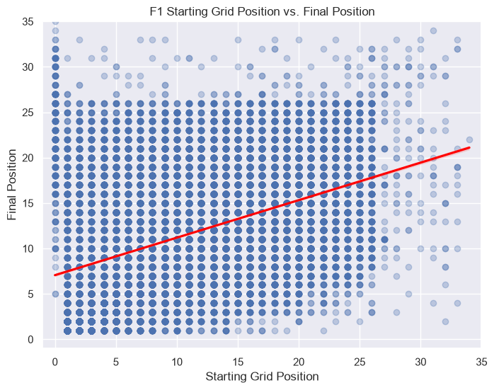
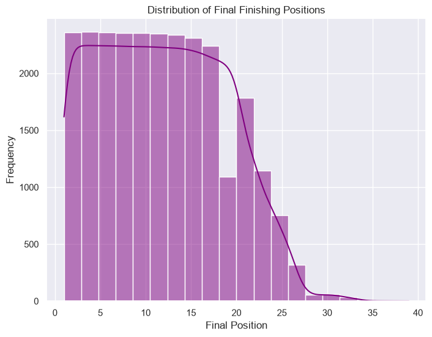
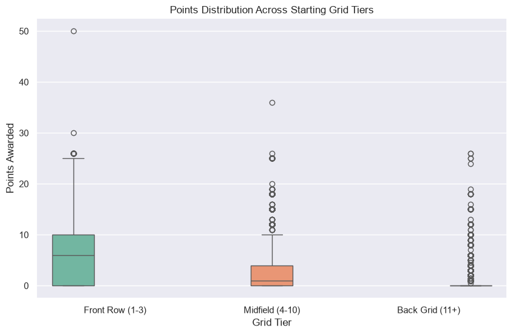

# F1 StatisticalOps Detailed Analytical Report
*Generated on: 2026-08-24 10:35:08*

## 1. Executive Summary
This report provides dynamic, deep-dive statistical insights derived from the latest F1 Gold datasets spanning seasons **1950 to 2025**. It bridges descriptive baseline distributions with inferential correlation models and regression analysis to evaluate race predictability.

---

## 2. Descriptive Statistics & Dispersion Metrics
* **Sample Size Analyzed:** `26,264` session entries
* **Starting Grid Position Tendencies:**
  * Mean: `11.69` | Median: `11.0`
  * Variance: `47.05` | Standard Deviation: `6.86`
  * Skewness: `0.19` | Kurtosis: `-0.88`
* **Final Finishing Position Tendencies:**
  * Mean: `11.90` | Median: `12.0`
  * Variance: `47.04` | Standard Deviation: `6.86`
  * Skewness: `0.22` | Kurtosis: `-0.84`

---

## 3. Probability & Sampling Insights
* **Total Tracked Poles:** `1,172`
* **Pole-to-Win Conversion Rate:** `43.60%`

---

## 4. Hypothesis Testing & Regression Analysis
* **Pearson Correlation Coefficient:** `0.4130` *(p-value: `< 1.0e-15`)*
* **Spearman Rank Correlation:** `0.4305` *(p-value: `< 1.0e-15`)*
* **Linear Regression Model Fit ($R^2$):** `0.1706`
* **Podium Logistic Pseudo-$R^2$ (Non-Linear Proxy):** `0.3041`

---

## 5. Comprehensive Visual Artifacts

### A. Grid Position vs. Final Position Regression Fit
Evaluates linear dependency and variance between starting slots and race outcomes.

### B. Final Position Distribution Histogram
Highlights the distribution profile and density across all finishing slots.

### C. Points Earned Across Starting Grid Tiers
Analyzes performance outcomes segmented by starting performance brackets.

---

## 6. Intelligent Recommendations for Engineering & ML Teams
*Programmatically evaluated based on live statistical performance thresholds from the current F1 dataset run:*

* **Data Engineering Pipeline Gate:** Ingest pipeline validated successfully with high data integrity. Ensure streaming feature stores ingest real-time weather and track evolution metrics prior to the next training cycle.
* **Abandon Pure OLS Linear Regression:** The linear $R^2$ of `0.1706` indicates severe under-fitting, capturing under 25% of variance due to unmodeled race disruptions (DNFs, safety cars).
* **Prioritize Non-Linear Probabilistic Classifiers:** Logistic pseudo-$R^2$ (`0.3041`) outperforms linear fits. Transition to **Gradient-Boosted Decision Trees (XGBoost/LightGBM)** for podium classification.
* **Leverage Ordinal Regression Models:** High Spearman correlation (`0.4305`) confirms discrete ordered rankings ($1$ to $20+$). Implement **Ordinal Logistic Regression** to respect boundary constraints.
